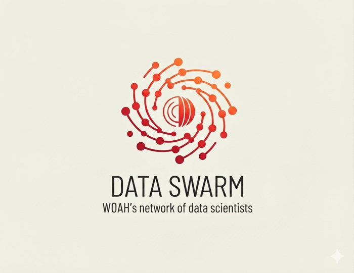

```{=html}
<section class="hero">
  <div class="hero-inner">
    <div class="kicker">World Organisation for Animal Health</div>
    <h1>Data Integration<br>&amp; Analytics Department</h1>
    <p class="lead">Technical material produced by DIAD: reports, code, datasets, models and training
    that turn animal health data into evidence and advice.</p>
    <a class="btn-woah" href="resources.html">Browse all material</a>
    <a class="btn-woah ghost" href="about.html">About the department</a>
  </div>
</section>

<div class="home-section">

<h2>Our four areas</h2>
<div class="area-grid">
  <a class="area-card obs" href="observatory/index.html">
    <div class="area-swatch">OBS</div>
    <div class="area-body">
      <span class="area-acronym">Business team</span>
      <h3>The Observatory</h3>
      <p>Monitors how Members implement WOAH standards and formulates recommendations.</p>
      <span class="more">Observatory material</span>
    </div>
  </a>
  <a class="area-card epiq" href="epiq/index.html">
    <div class="area-swatch">EPIQ</div>
    <div class="area-body">
      <span class="area-acronym">EPIQ · Business team</span>
      <h3>Epidemiology &amp; Quantitative Intelligence</h3>
      <p>Situation reports, surveillance data integration and model-based risk intelligence.</p>
      <span class="more">EPIQ material</span>
    </div>
  </a>
  <a class="area-card ahe" href="econometrics/index.html">
    <div class="area-swatch">AHE</div>
    <div class="area-body">
      <span class="area-acronym">Business team</span>
      <h3>Animal Health Econometrics</h3>
      <p>Quantifying the economic side of animal health, with academic partners.</p>
      <span class="more">Econometrics material</span>
    </div>
  </a>
  <a class="area-card dsl" href="dslab/index.html">
    <div class="area-swatch">DSL</div>
    <div class="area-body">
      <span class="area-acronym">DS Lab · Transversal</span>
      <h3>Data Science Lab</h3>
      <p>Data products, master datasets, APIs, automation and AI adoption across WOAH.</p>
      <span class="more">DS Lab material</span>
    </div>
  </a>
</div>

<h2>Recently published</h2>
</div>
```

::: {.home-section}
::: {#latest}
:::

[See all material →](resources.qmd){.btn-woah .ghost-dark}
:::

```{=html}
<div class="home-section">
<div class="band" style="display:flex;gap:2rem;align-items:center;flex-wrap:wrap;margin-top:2.5rem">
  
  <div style="flex:1;min-width:260px">
    <h2 style="margin-top:0">The Data Swarm</h2>
    <p>DIAD works with the Data Science and Quantitative Epidemiology Network: seven WOAH Collaborating Centres
    in six countries, plus academic partners in Japan and South Korea.</p>
    <a class="btn-woah" href="network.html">Meet the network</a>
  </div>
</div>
</div>
```
