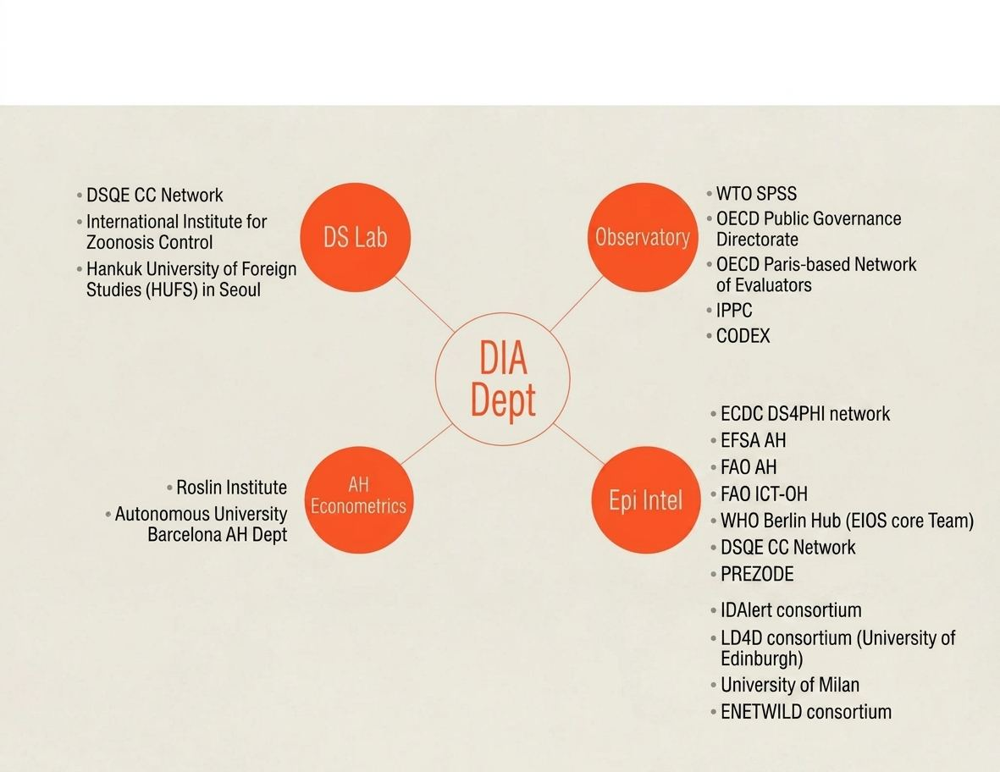

## First orbit: the Data Swarm

::: {.grid}
::: {.g-col-12 .g-col-md-4}
{fig-alt="Data Swarm logo: WOAH's network of data scientists"}
:::
::: {.g-col-12 .g-col-md-8}
The **DSQE network**, aka the Data Swarm, is WOAH's network of data scientists. It brings together **7 WOAH Collaborating Centres in 6 countries** working on epidemiology, risk analysis, modelling and surveillance.
:::
:::

```{=html}
<table class="woah-table table">
<thead><tr><th>Collaborating Centre</th><th>Host institution / country</th></tr></thead>
<tbody>
<tr><td>Veterinary Epidemiology &amp; Public Health</td><td>Massey University, New Zealand / CAHEC, China</td></tr>
<tr><td>Epidemiology &amp; Risk Assessment of Aquatic Animal Diseases (Europe)</td><td>Norwegian Veterinary Institute, Norway</td></tr>
<tr><td>Risk Analysis &amp; Modelling</td><td>Royal Veterinary College / APHA, UK</td></tr>
<tr><td>Epidemiology, Modelling &amp; Surveillance</td><td>IZS Abruzzo e Molise, Italy</td></tr>
<tr><td>Epidemiology, Training &amp; Control of Emerging Avian Diseases</td><td>IZS delle Venezie, Italy</td></tr>
<tr><td>Wildlife Health Surveillance &amp; Epidemiology</td><td>Mahidol University, Thailand</td></tr>
<tr><td>Animal Disease Surveillance, Risk Analysis &amp; Epidemiological Modeling</td><td>USDA APHIS CEAH, USA</td></tr>
</tbody>
</table>
```

## Second orbit: academic partners

Individual academic partnerships, outside the formal Collaborating Centre network.

- Hokkaido University, Sapporo, Japan
- Hankuk University of Foreign Studies, Seoul, South Korea

## Partners by area

{fig-alt="Map of DIAD collaborators by area" .lightbox}

::: {.band}
**Join the network.** WOAH Collaborating Centres and academic groups working on animal health data science can contact DIAD at **diad @ woah . org**.
:::
